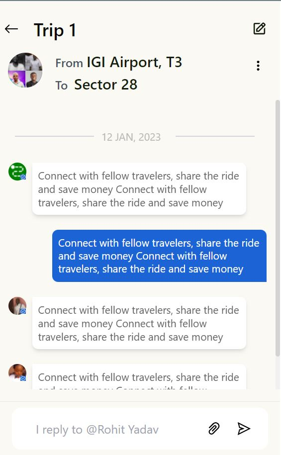

# CoRider - Front End Intern Assignment solution

This is my solution to the CoRider - Front End Intern Assignment.

## Table of contents

- [The challenge](#the-challenge)
- [Screenshot](#screenshot)
- [Links](#links)
- [Built with](#built-with)
- [What I learned](#what-i-learned)
- [Useful resources](#useful-resources)
- [Author](#author)

### The challenge

The application should implement the usual behaviour of any chat application on your phone i.e., open the most recent chat message and when scrolled above a certain threshold it should make a call to above API by incrementing the page number to retrieve older chats. However, there is no need to update the chat headers on subsequent hits.

### Screenshot

### Links

- Solution URL: [Github](https://github.com/DhairyaSehgal07/co-rider)
- Live Site URL: [https://dhairya07-corider-assignment.netlify.app/](https://dhairya07-corider-assignment.netlify.app/)

### Built with

- Semantic HTML5 markup
- CSS custom properties
- Flexbox
- Mobile-first workflow
- [React](https://reactjs.org/) - JS library
- [Tailwind css](https://tailwindcss.com/) - For styles

### What I learned

Loading more messages after scrolling through a certain threshold was the tricky part.Through it's implementation i learned about various scrolling methods in javascript.It also deepened my knowledge of react hooks (useState, useEffect,useRef).

### Useful resources

- [React dev docs](https://react.dev/) - This helped me to gain an understanding of react hooks
- [Tailwind css docs](https://tailwindcss.com/) - This is an amazing article which helped me find the suitable styles for my components.It also helped me with the syntax of tailwind css

## Author

- Website - [Dhairya Sehgal](https://dhairya-sehgal-portfolio.netlify.app/)
